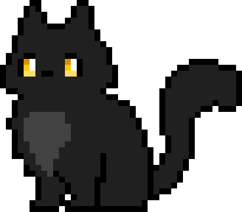

<h2>Hey, pessoal! 👩‍💻✨</h2>

Eu sou a **Jessika**, direto do **Rio Grande do Sul** pro mundo da **tecnologia e design** 💙

🎓 **Sistemas de Informação** na Antonio Meneghetti Faculdade  

Curiosa por natureza: tutoriais, vídeos, cursos online… o que tiver, eu tô explorando! Amo unir o lado técnico com o criativo nos meus projetos 🚀

 

### 💻 Tech Stack & Tools

### 📲 Let's connect & create 💡

